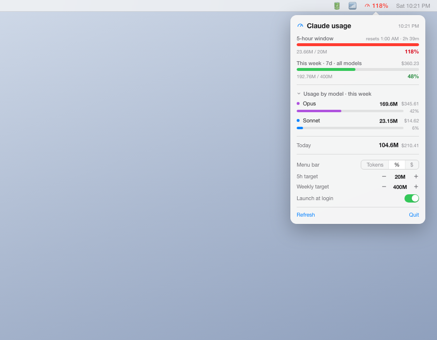

# ClaudeMeter

A tiny native macOS menu bar app that shows Claude Code token usage at a glance — no app or settings to open.

Reads transcripts directly from `~/.claude/projects/**/*.jsonl` and shows:

- **5-hour limit window** — the rolling window Claude resets on, with a live countdown
- **This week (7-day, all models)** usage against an adjustable token target
- **Usage by model this week** — a collapsible table with a mini progress bar per model (Opus / Sonnet / Haiku), so you can see which model is eating your weekly budget
- **Today's** tokens and estimated cost
- Menu bar label toggle: tokens, %, or $

Token counts are read directly from the same local log files Claude Code writes (`~/.claude/projects/**/*.jsonl`), deduped by request ID — they are exact, not estimates. The **cost** shown is a modeled *estimate of equivalent API list price* using published per-model rates (including the 1.25x / 2x / 0.1x multipliers for 5-min cache write, 1-hour cache write, and cache read) — useful for comparing which sessions or models are heavier, not an actual bill (Claude subscriptions are flat-rate).

Anthropic doesn't expose your exact plan cap locally, so every limit bar uses a **target you set** (+/- steppers in the panel, persisted). Tune each until it matches where you actually hit that limit. If usage exceeds the target, the percentage is shown uncapped (e.g. 118%) even though the bar itself maxes out visually at 100%.

## Screenshot



## Download

Grab the latest `ClaudeMeter.dmg` from [Releases](../../releases), or build it yourself below.

## Build & run

```bash
./build.sh                                  # builds build/ClaudeMeter.app
cp -R build/ClaudeMeter.app /Applications/   # install
open /Applications/ClaudeMeter.app
```

Requires Xcode command line tools (`swiftc`). No third-party dependencies.

Enable **Launch at login** from the panel footer, or add it manually via System Settings → General → Login Items.

## Notes

- Compiled with `-target arm64-apple-macos13.0` in `build.sh` — pinning this avoids macOS rejecting the app with `kLSIncompatibleSystemVersionErr` (-10825) when the default toolchain deployment target is newer than the running OS.
- Ad-hoc code signed (`codesign --sign -`) — fine for local use; no Developer ID required.
